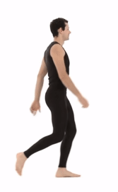

# Biomechanics of Motion - Project 2019

Project for the course of Biomechanics of Motion (Fall 2019) lectured in [IST](http://tecnico.ulisboa.pt/) from the University of Lisbon.
Programmed in Matlab.

---

Projection of movement onto a main axis.
Because the subject may not walk perfectly in the direction of one of the main axis in the laboratory, then some correction may be needed.
PCA (Principal Component Analysis) is used here to force the movement to happen in the X direction.

---

Two different motions were studied: a simple walk stride and a deadlift exercise.

| Walk stride example | Stick-figure constructed from the collected lab data |
:----:|:------:
 | 

| Deadlift example | Stick-figure constructed from the collected lab data |
:----:|:------:
 | 
